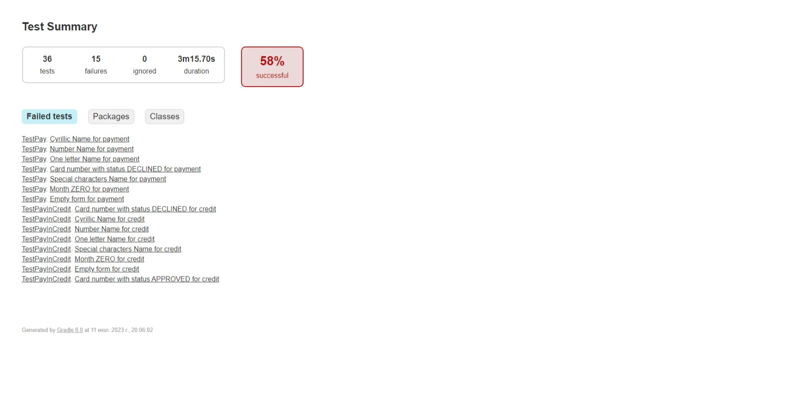
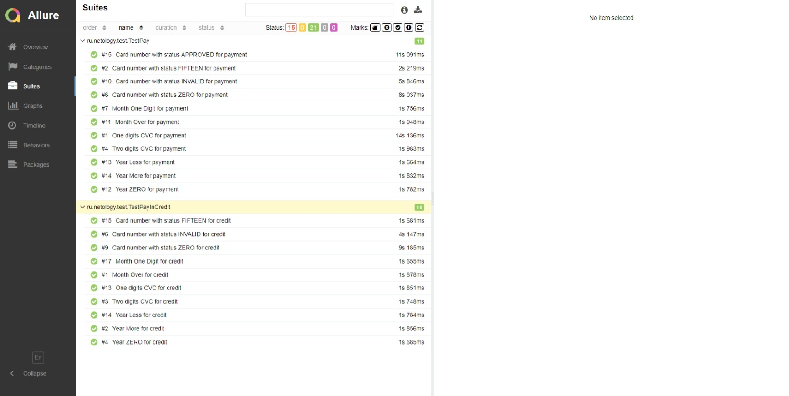
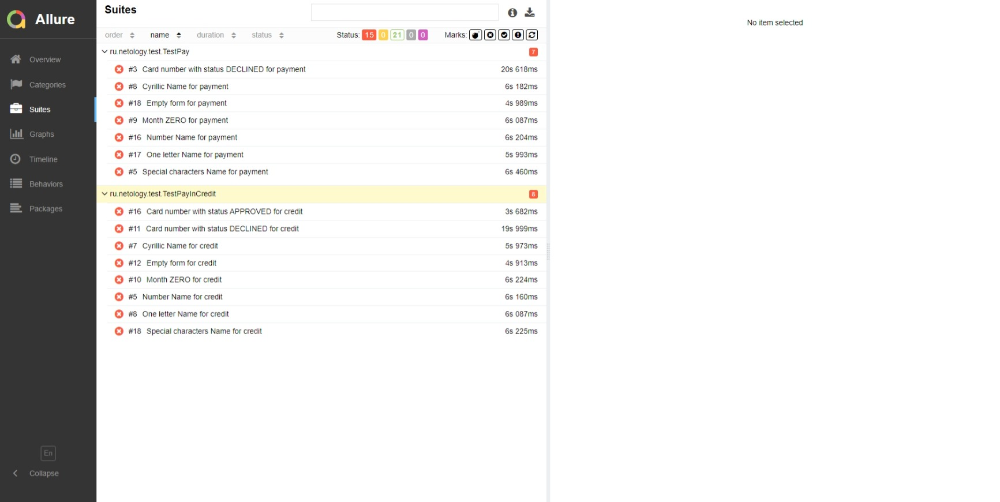

# Отчёт о проведённом тестировании

## Краткое описание

Было проведено автоматизированное тестирование функционала веб-сервиса "Путешествие дня", взаимодействующего с СУБД и API Банка.

В ходе тестирования были задействованы сервисы:
* сервис платежей, Payment Gate;
* кредитный сервис, Credit Gate.

Тестирование проведено с использованием СУБД:
* MySQL;
* PostgreSQL.

## 2. Количество тест-кейсов

- Всего тест-кейсов: 36

  

  

- Успешных тест-кейсов: 21

  

- Неуспешных тест-кейсов: 15

  

## 3. Процент успешных/неуспешных тест-кейсов

- Процент успешных: 58.33%
- Процент неуспешных: 41.66%

## 4. Общие рекомендации

1. Устранить обнаруженные [проблемы](https://github.com/Iva163/Diplom/issues);
2. Добавить уникальные идентификаторы для элементов страниц (test-id) для ускорения и упрощения
   автоматизации тестирования;
3. Составить подробную и однозначную документацию к приложению.